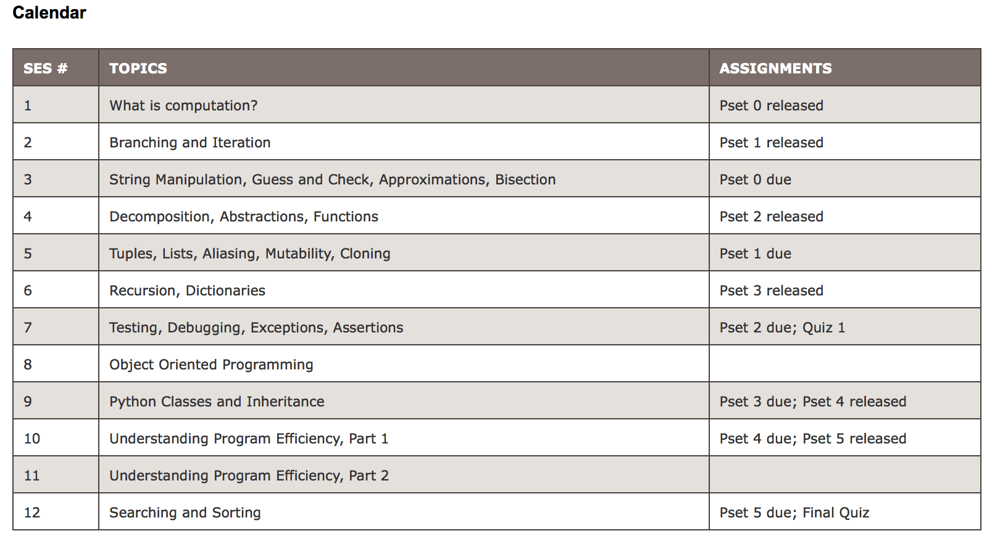

# 6.0001



## 4. Decomposition, Abstraction, and Functions

scope 令人迷惑，
http://pythontutor.com 这个网站可以帮助理解

* L （Local） 局部作用域
* E （Enclosing） 闭包函数外的函数中
* G （Global） 全局作用域
* B （Built-in） 内建作用域

> Python以L –> E –> G –>B的规则查找变量，即：在局部找不到，便会去局部外的局部找（例如闭包），再找不到就会去全局找，最后去内建中找。如果这样还找不到，那就提示变量不存在的错误。


## 5. Tuples, Lists, Aliasing, Mutability, and Cloning

two new data types

* tuple
* list
  
### tuple

immutable

index

**return tuple** used to return more than one value

```python
te = () 
# there is nothing in the tuple te
t = (2, 'mit', 3) 
# A tuple contains some elements by seprating each element with a comma (',')
twithoutcomma = ('mit')
# This a string 'mit'
twithcomma = ('mit',)
# a tuple
t[0] = 2
# gives TypeError, cuz tuple is immutalbe
(x, y) = (y, x)
# swap variabe values
```

### list

记住 **side effect**

Avoiding mutating a list as you are iterating over it, elements will be skipped.

```python
id(object) # A fuction which returns the address of the object in memory

hot = [1, 3, 2]
warm = hot
# warm 是hot 的alias，指向同一个地址
warm.append('b')
# append has a side effect， 即不是重新建立一个list，而是修改原来的list的值
# so, how to create a new list and copy every element of an old list?
new = old[:]
# distinguish sort() sorted()
hot.sort() # hot = [1, 2, 3], mutate the list
# but if
sorted(hot) # hot = [1, 3, 2], should assign the result to a variable
```

## 6. Recursion and Dictionaries

### Recursion

递归挺简单，中学时候就被一大堆数学题训练好了

### Dictionary

